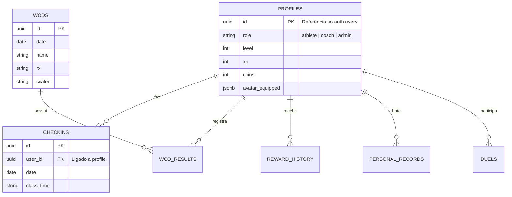

# Dicionário de Dados e Relacionamentos (Database Schema)

Este documento descreve as tabelas utilizadas no Supabase (PostgreSQL) para o ecossistema do **CrossCity Hub (BoxLink)**. Ele serve como o guia definitivo dos dados e suas conexões.

## 1. Visão Geral das Entidades

Nosso banco relacional possui 12 tabelas principais agrupadas nos seguintes domínios:

### 👤 Domínio de Usuário e Gamificação
*   **`profiles`**: Estende os usuários autenticados (`auth.users`). Armazena o Perfil, Nível (Level), Experiência (`xp`), Moedas (`coins`) e também o *Avatar* (equipamentos e inventário em JSON/Array).
*   **`reward_history`**: Tabela de log (Histórico). **Crítica** para rastreabilidade de como o atleta ganhou suas Moedas/XP (via Check-in, Duelo, Desafios, etc). 
*   **`avatar_economy_settings`**: Tabela de configuração global que define o quanto de XP e Coins uma ação vale (parametrizável para o Admin).

### 💪 Domínio do Box (Treinos e Aulas)
*   **`box_settings`**: Controle global da filial/box (nome, logomarca, lat/lng do GPS, raio de validação do check-in e layout da TV).
*   **`schedule`**: Os horários estáticos de aula semanais cadastrados pelo Box.
*   **`checkins`**: Registro diário atestando a presença do atleta em uma determinada aula.
*   **`wods`**: Os Treinos do Dia cadastrados pelos Coaches (com etapas Warmup, Skill, RX, Scaled).
*   **`wod_results`**: Os resultados individuais dos atletas após finalizarem um `wod`.
*   **`personal_records`**: (PRs) Os recordes pessoais atemporais dos alunos em levantamento de peso e movimentos de ginástica.

### 🎮 Domínio End-Game (Duelos, Loja e Desafios)
*   **`items`**: Catálogo de roupas, fundos e acessórios da loja que podem ser comprados com BrazaCoins.
*   **`duels`**: Duelos PvP. Relaciona um Desafiante (`challenger_id`), um Oponente (`opponent_id`) e quem logrou a vitória (`winner_id`) levando a aposta da mesa.
*   **`challenges`**: Metas periódicas criadas pela administração (Ex: Remar 50km no mês).

---

## 2. Diagrama Entidade-Relacionamento (Relacional Simples)

## 3. Segurança (RLS - Row Level Security)
Por política rigorosa no banco de dados (`supabase_schema.sql`):
*   Ninguém (a interface web) consegue editar livremente suas `coins` ou `xp`. 
*   O *Update* de perfil (`profiles`) garante que usuários não corrompam a economia, forçando o uso de funções autorizadas do backend para ganhos de reputação. 
*   O histórico de resultados dos WODs (`wod_results`) é de leitura pública (necessário para os rankings globais do Leaderboard).
